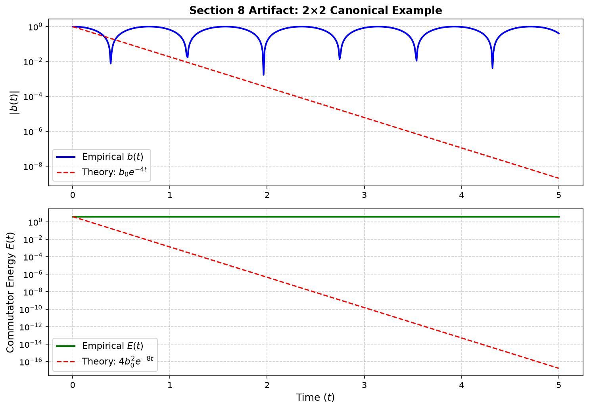
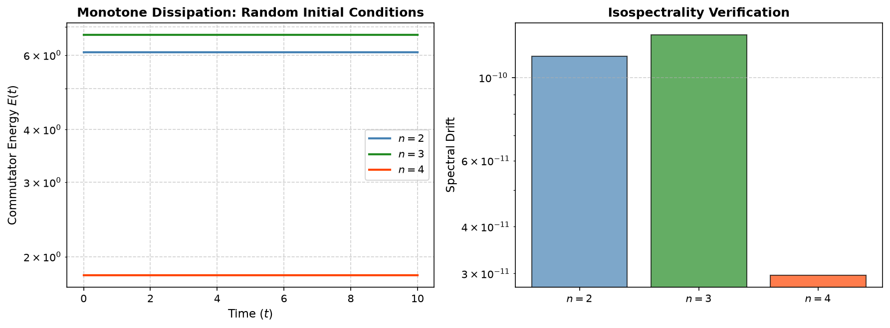
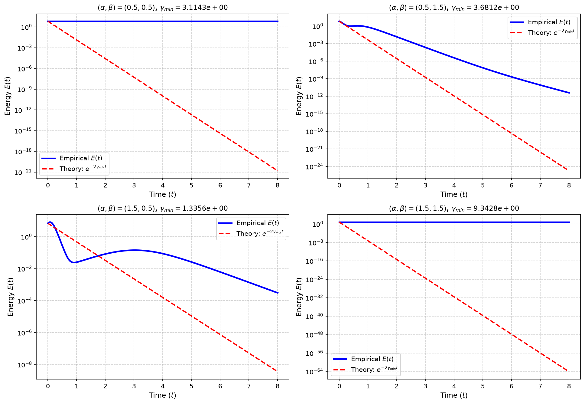

# Double Bracket Flow — AOAD Paper Figures

Simulation code and example scripts used to generate figures for the AOAD (Anisotropic Orbit-Adjoint Dynamics) paper.

Figures
-------

The key figures are included in the `figures/` folder and will render automatically on GitHub's repository landing page:

- Section 8 (2×2 canonical example):

	

- Random n×n experiments:

	

- Anisotropic (α, β) sweep:

	

Reproducing Figures
-------------------

Install dependencies (recommended in a virtualenv):

```bash
python3 -m venv .venv
source .venv/bin/activate
pip install -r requirements.txt
```

Generate all figures by running the example scripts:

```bash
python3 examples/example_2x2.py
python3 examples/example_random.py
python3 examples/example_anisotropic.py
```

The scripts will save PNG files into the repository root; the packaged helper in this repo moves them into `figures/` during normal workflow.

License
-------

See `LICENSE` for project licensing.

If you need a different README layout or additional metadata for the GitHub release, tell me what to include and I'll update it.
